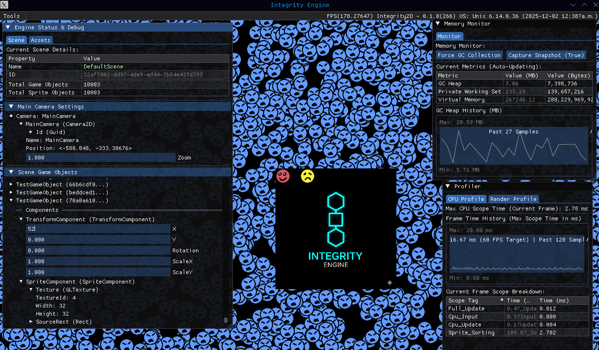

# IntegrityGameDemo 

A minimal example project demonstrating the core features and setup of the **Integrity2D** game engine.

* **Engine GitHub:** [https://github.com/EZroot/Integrity2D](https://github.com/EZroot/Integrity2D)
* **Engine Documentation:** [https://ezroot.github.io/Integrity2D/](https://ezroot.github.io/Integrity2D/)



---

## How to Run the Demo

1.  **Clone the repository** (if you haven't already).
2.  **Clone the Integrity2D repository** (if you haven't already).
3.  **Ensure Integrity2D repository is reference correctly** (in your .csproj)

```xml
  <ItemGroup>
      <ProjectReference Include="..\Integrity2D\Integrity2D.csproj" />
  </ItemGroup>
```
4.  **Navigate** to the `IntegrityGameDemo` directory.
5.  **Run** the project using the .NET CLI:

```bash
dotnet run
```

---

### Project Structure

To ensure the engine can find its assets, the project directory must contain two key folders relative to the `.csproj` file:

1.  **`Content/`**: Contains all **game-specific assets** (images, sounds, maps) used by the `IntegrityGameDemo` project.
2.  **`Shaders/`**: Contains all **engine shaders** required by the `Integrity2D` engine itself (e.g., `default.vert`, `default.frag`).

### Asset Copy Configuration (`.csproj`)

We copy Content/ and Shaders/ folder to our build here:

```xml
  <ItemGroup>
      <Content Include="Content\**">
        <CopyToOutputDirectory>PreserveNewest</CopyToOutputDirectory>
      </Content>
  </ItemGroup>

  <ItemGroup>
      <Content Include="Shaders\**">
        <CopyToOutputDirectory>PreserveNewest</CopyToOutputDirectory>
      </Content>
  </ItemGroup>
```

### Dependencies

The project uses the following external NuGet packages:

```xml
  <ItemGroup>
    <PackageReference Include="ImGui.NET" Version="1.91.6.1" />
    <PackageReference Include="Silk.NET.OpenAL" Version="2.22.0" />
    <PackageReference Include="Silk.NET.OpenGL" Version="2.22.0" />
    <PackageReference Include="Silk.NET.OpenGL.Extensions.ImGui" Version="2.22.0" />
    <PackageReference Include="Silk.NET.SDL" Version="2.22.0" />
    <PackageReference Include="StbImageSharp" Version="2.30.15" />
  </ItemGroup>
```